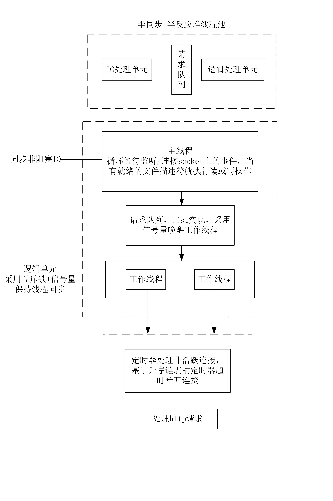

---

---

# TinyHttpServer
- [TinyHttpServer](#tinyhttpserver)
  - [描述](#描述)
  - [框架](#框架)
  - [运行](#运行)
  - [项目笔记](#项目笔记)
  - [不足](#不足)
  - [参考资料](#参考资料)

## 描述

- 利用IO复用技术Epoll + 非阻塞I/O + 线程池实现多线程的模拟Proactor高并发服务器模型（还有比如共享内存）
- 使用状态机解析HTTP请求报文
- epoll 使用 EPOLLONESHOT 保证一个 socket 连接在任意时刻都只被一个线程处理
- 经Webbench压力测试可以实现每分钟上万的并发连接数据交换（取决于服务器性能）

## 框架

## 运行

- 编译

  `g++ *.cpp -pthread`

- 运行

  `./可执行文件名 端口号`

  浏览器访问：IP:端口号/index.html

- 压力测试：

  进入test_pressure文件夹，

  `./webbench -c 客户端数目 -t 事件 网址`

## 项目笔记

https://blog.csdn.net/sansipi/category_11532916.html?spm=1001.2014.3001.5482

## 不足

把互斥锁换成读写锁，减小锁的粒度，实现更高的性能

主线程选择工作线程的方法是随机的，可以采用更加智能的算法

采用正则表达式解析http请求

支持https

根据并发量，任务执行时间设计线程池

服务器数据库实现web端用户注册、登录功能，可以请求服务器图片和视频文件

引入C++新特性，如智能指针

...

## 参考资料

1. Linux高性能服务器 游双
2. https://github.com/qinguoyi/TinyWebServer
3. Unix 网络编程卷1

